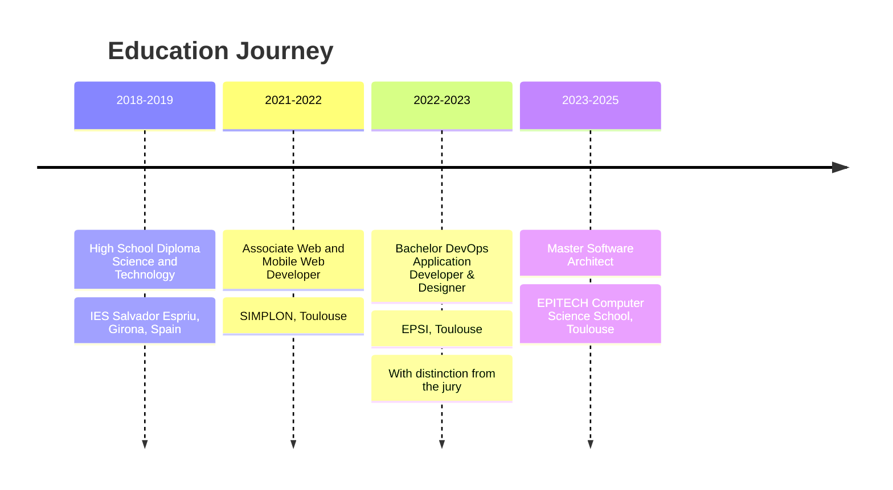
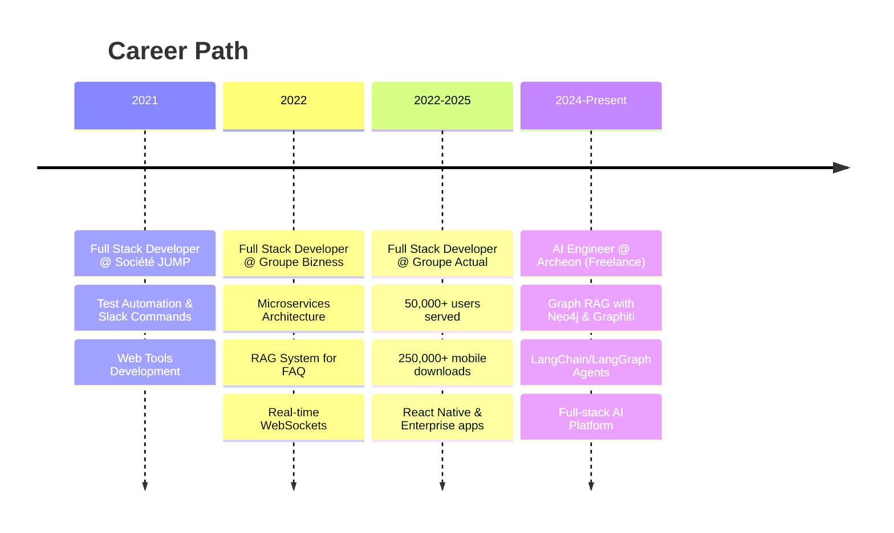

<div align="center">

# 🧠 Mustapha El Hachmi Mahti

### AI Engineer & Agentic Systems Architect

[](https://git.io/typing-svg)


</div>

---

## 🎯 About Me

I'm an **AI Engineer** specialized in developing **agentic systems** and **advanced RAG architectures**. Expert in **LangChain**, **LangGraph**, and **Graph RAG**, I design autonomous agents capable of reasoning, planning, and interacting with complex knowledge bases. I transform LLMs into scalable production systems with knowledge graphs (Neo4j), vector databases (Pinecone, pgvector), and multi-agent orchestration to create high-impact AI solutions.

```python
class AIEngineer:
    def __init__(self):
        self.name = "Mustapha El Hachmi Mahti"
        self.role = "AI Engineer & Agentic Systems Architect"
        self.location = "Toulouse, Occitanie, France 🇫🇷"
        self.email = "mustaelhachmimahti@gmail.com"
        self.phone = "0750018388"
        self.website = "https://mustapha-elhachmi.tech"
        self.knowledge_base = [
            "LangChain", "LangGraph", "Graph RAG", "LLMs",
            "Autonomous Agents", "Knowledge Graphs", "Vector Databases"
        ]

    def current_focus(self):
        return "Building AI-powered Knowledge Management with Graph RAG"

    def life_philosophy(self):
        return "Transform complexity into intelligence"
```

### 🔥 Quick Stats

- 🎓 **Master's in Software Architecture** - EPITECH (2023 - 2025)
- 🎓 **Bachelor DevOps Application Developer & Designer** - EPSI (2022 - 2023) _With distinction from the jury_
- 💼 **4+ years** building production AI & Full-Stack systems
- 📱 Apps serving **50,000+ users** | **250,000+ mobile downloads**
- 🧠 **Specialist** in Graph RAG, LangChain, LangGraph & Autonomous Agents
- 🌍 **Multilingual**: French (native), Arabic (native), Catalan (native), Spanish (native), English (fluent), Italian (conversational)

---

## 💼 Professional Experience

### � Full Stack Developer | Groupe Actual, Toulouse

**September 2022 — September 2025**

- **Web Development**: Design and development of complex React/TypeScript applications (50,000+ users) with optimized user interfaces and sophisticated state management
- **Mobile Applications**: Cross-platform iOS/Android development with React Native/Expo (250,000+ downloads)
- **Backend Architecture**: Design of NestJS microservices with RESTful APIs, PostgreSQL/MongoDB databases
- **Performance & Scalability**: Optimization of web and mobile performance (+30% speed improvement), implementation of caching solutions and real-time monitoring
- **Data Engineering**: BigQuery development for business analytics and development of high-availability data pipelines

**Stack**: React, TypeScript, React Native, NestJS (NodeJS), MySQL, Redis, GCP

---

### 🔷 Full Stack Developer | Groupe Bizness, Toulouse

**January 2022 — August 2022**

- **Microservices Architecture**: Development of event-driven architecture with multi-source aggregation APIs
- **RAG System for FAQ**: RAG implementation with Pinecone vector database for intelligent FAQ feature with embeddings and semantic search
- **Real-Time Applications**: Implementation of WebSockets and Server-Sent Events for collaborative interfaces
- **Database and API**: Development of APIs with SAP HANA database

---

### 🔷 Full Stack Developer | Société JUMP, Toulouse

**May 2021 — July 2021**

- **Test Automation**: E2E with Cypress, WebDriver, Cucumber JS and Gherkin syntax
- **Custom Slack Commands Development**: with Bolt JS and NestJS
- **Web Tools Creation**: automated to improve team productivity

---

### 🔷 Archeon - AI Knowledge Management Platform (Freelance)

**June 2024 — Present**

_Full-stack document management platform powered by Graph RAG and agentic systems._

- **Graph RAG & Knowledge Graphs**: Graph RAG architecture with Neo4j and Graphiti for entity extraction, relationship mapping, and knowledge graph generation from documents
- **AI Agents & LLM Orchestration**: Implementation of autonomous agents with LangChain/LangGraph for intelligent Q&A, automatic classification, and multi-modal semantic search
- **AI Microservices Architecture**: Distributed NestJS + FastAPI stack with Celery workers for asynchronous processing (OCR, embeddings, graph building), PostgreSQL+pgvector for vector search
- **Multi-Platform Applications**: NextJS (React) interface and React Native/Expo mobile app with JWT authentication, Redis rate limiting, and Cloudflare R2 storage

**Stack**: LangChain, LangGraph, Neo4j, FastAPI, NestJS, PostgreSQL+pgvector, Celery, Redis, React (NextJS), React Native

---

## 🛠️ Tech Stack

### 🤖 AI & Agentic Systems


### 🔮 Vector & Knowledge Databases


### ⚙️ Backend & Microservices


### 💻 Full-Stack Development


---

## 🧠 AI/ML Expertise

<div align="center">

| Domain                         | Technologies & Skills                                                                |
| ------------------------------ | ------------------------------------------------------------------------------------ |
| **🤖 AI & Agentic Systems**    | LangChain, LangGraph, RAG, Graph RAG, LLM, Autonomous Agents, Prompt Engineering, RL |
| **� Vector & Knowledge DBs**   | Neo4j, Graphiti, Pinecone, pgvector, Elasticsearch, Embeddings, Semantic Search      |
| **⚙️ Backend & Microservices** | FastAPI, NestJS, NodeJS, PostgreSQL, MongoDB, Redis, Celery, RabbitMQ, RESTful APIs  |
| **� Full-Stack Development**   | TypeScript, Python, React, NextJS, React Native, Docker, CI/CD                       |

</div>

---

## 🎓 Education



---

## 💼 Professional Journey



---

## 🌍 Languages

<div align="center">

| Language   | Proficiency    |
| ---------- | -------------- |
| 🇫🇷 French  | Native         |
| 🇲🇦 Arabic  | Native         |
| 🇪🇸 Catalan | Native         |
| 🇪🇸 Spanish | Native         |
| 🇬🇧 English | Fluent         |
| 🇮🇹 Italian | Conversational |

</div>

---

## 🌟 What Drives Me

- 🤖 **Agentic AI Systems** — Building autonomous agents with LangChain & LangGraph
- 🔮 **Graph RAG Innovation** — Pushing the boundaries of knowledge graph + LLM integration
- 🧠 **Intelligent Systems** — Building AI that truly understands and processes complex data
- ⚡ **Production AI** — Scalable ML infrastructure with microservices and async processing
- 🔍 **Advanced Retrieval** — Hybrid search systems combining semantic, keyword, and graph traversal
- 📚 **Knowledge Engineering** — Transforming unstructured documents into queryable knowledge bases

---

## 📫 Let's Connect!

<div align="center">

[](https://linkedin.com/in/Mustapha%20El%20Hachmi%20Mahti)
[](https://instagram.com/soymusta)
[](https://mustapha-elhachmi.tech)
[](mailto:mustaelhachmimahti@gmail.com)

📍 **Toulouse, Occitanie, France** | 📞 **0750018388**

</div>

---

<div align="center">

### 💭 _"Transforming documents into knowledge, complexity into intelligence"_


---

**🧠 Open to collaborations on AI, Agentic Systems, RAG, and Knowledge Graph projects**

</div>

---

⭐️ From [soymustamahti](https://github.com/soymustamahti) — Building the future of intelligent agentic systems
