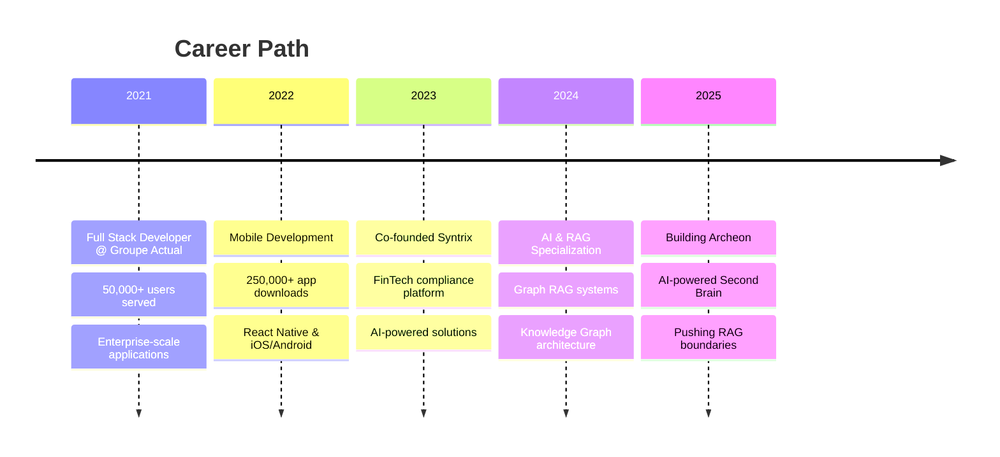

<div align="center">

# 🧠 Mustapha El Hachmi Mahti

### AI Engineer | RAG Systems Architect | Knowledge Graph Specialist

[](https://git.io/typing-svg)


</div>

---

## 🎯 About Me

I'm a **Software Engineer** specialized in **AI systems**, **RAG architectures**, and **Knowledge Graphs**. I design and build intelligent systems that transform unstructured data into actionable knowledge.


```python
class AIEngineer:
    def __init__(self):
        self.name = "Mustapha El Hachmi Mahti"
        self.role = "AI & RAG Systems Architect"
        self.location = "France 🇫🇷"
        self.knowledge_base = [
            "Graph RAG", "LLMs", "Knowledge Graphs",
            "Vector Databases", "NLP", "ML Pipelines"
        ]
    
    def current_focus(self):
        return "Building AI-powered Second Brain systems"
    
    def life_philosophy(self):
        return "Transform complexity into intelligence"
```

### 🔥 Quick Stats
- 🎓 **Master's in Software Architecture** - EPITECH
- 💼 **3+ years** building production AI & Full-Stack systems
- 📱 Apps serving **50,000+ users** | **250,000+ mobile downloads**
- 🚀 **Co-founder** of Syntrix (FinTech compliance platform)
- 🧠 **Specialist** in Graph RAG, LLMs, and Knowledge Management

---

## 🎯 What I Build

<div align="center">

### 🔮 AI-Powered Knowledge Systems

</div>

I specialize in building intelligent systems that transform unstructured data into actionable knowledge:

```typescript
const myExpertise = {
  graphRAG: {
    frameworks: ["Graphiti", "LangChain", "LlamaIndex"],
    databases: ["Neo4j", "pgvector", "Elasticsearch"],
    capabilities: "Entity extraction, relationship mapping, hybrid retrieval"
  },
  aiSystems: {
    models: ["GPT-4", "LLaMA", "Claude", "DeepSeek"],
    techniques: ["Prompt Engineering", "RAG", "Fine-tuning", "Embeddings"],
    applications: "Document intelligence, Q&A, classification, NER"
  },
  production: {
    architecture: ["Microservices", "Async Workers", "Event-Driven"],
    stack: ["FastAPI", "NestJS", "Celery", "Docker", "Kubernetes"],
    focus: "Scalable, production-ready AI solutions"
  }
};
```

#### 🏗️ System Architecture Expertise

| Component | Technologies |
|-----------|-------------|
| 🔮 **Knowledge Graphs** | Neo4j, Graphiti, Entity extraction, Relationship mapping |
| 🔍 **Vector Search** | pgvector, Pinecone, Semantic search, Hybrid retrieval |
| 🤖 **LLM Integration** | OpenAI, Fireworks AI, Prompt engineering, RAG pipelines |
| ⚡ **Async Processing** | Celery, RabbitMQ, Redis, Background workers |
| 🛠️ **Backend APIs** | FastAPI (Python), NestJS (TypeScript), GraphQL |
| 📱 **Full-Stack** | React Native, Next.js, TypeScript, Tailwind CSS |

---

## 🛠️ Tech Stack

### 🤖 AI & RAG Systems


### 🔮 Knowledge Graphs & Vector DBs


### ⚙️ Backend & APIs


### 💻 Frontend & Mobile


### ☁️ DevOps & Infrastructure


---

## 🧠 AI/ML Expertise

<div align="center">

| Domain | Technologies & Skills |
|--------|----------------------|
| **🔮 Graph RAG** | Graphiti, Neo4j, Entity Extraction, Relationship Mapping |
| **📚 RAG Systems** | LangChain, LlamaIndex, Vector Search, Hybrid Retrieval |
| **🧠 LLMs** | OpenAI GPT-4, LLaMA, Fireworks AI, Prompt Engineering |
| **🔍 Search & Retrieval** | Semantic Search, BM25, Hybrid Search, Reranking |
| **📊 NLP** | Text Classification, NER, Embeddings (Nomic, OpenAI) |
| **⚙️ ML Pipelines** | Celery, Async Processing, Model Serving |
| **💾 Vector Databases** | pgvector, Pinecone, Elasticsearch, Redis |

</div>


## 💼 Professional Journey



---

## 🌟 What Drives Me

- 🔮 **Graph RAG Innovation** — Pushing the boundaries of knowledge graph + LLM integration
- 🧠 **Intelligent Systems** — Building AI that truly understands and processes complex data
- ⚡ **Production AI** — Scalable ML infrastructure with microservices and async processing
- 🔍 **Advanced Retrieval** — Hybrid search systems combining semantic, keyword, and graph traversal
- 📚 **Knowledge Engineering** — Transforming unstructured documents into queryable knowledge bases

---

## 📫 Let's Connect!

<div align="center">

[](https://linkedin.com/in/Mustapha%20El%20Hachmi%20Mahti)
[](https://instagram.com/soymusta)
[](https://yourportfolio.com)
[](mailto:contact@mustapha.dev)

</div>

---

<div align="center">

### 💭 *"Transforming documents into knowledge, complexity into intelligence"*


---

**🧠 Open to collaborations on AI, RAG, and Knowledge Graph projects**

</div>

---

⭐️ From [soymustamahti](https://github.com/soymustamahti) — Building the future of intelligent systems
