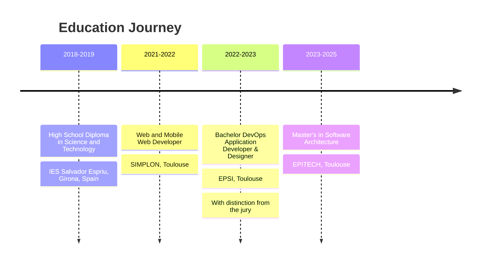
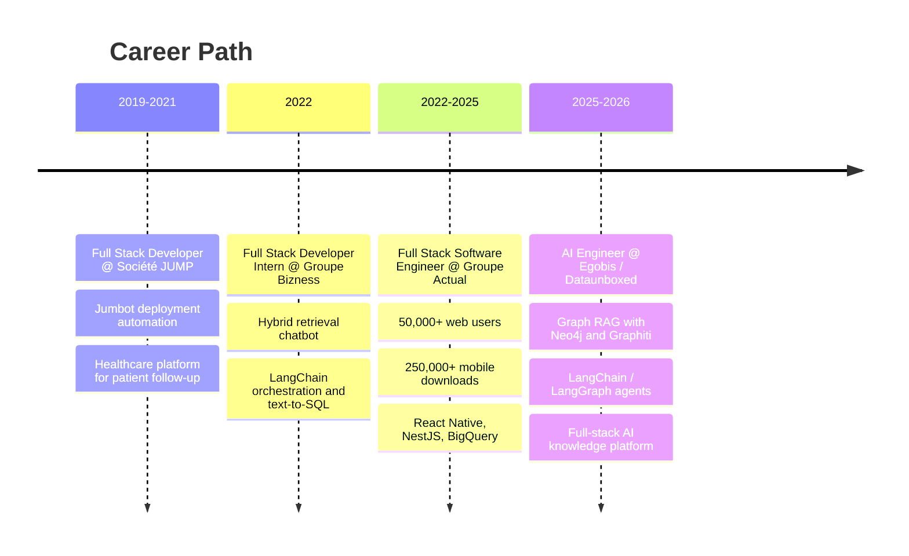

<div align="center">

# Mustapha El Hachmi Mahti

### AI Engineer & Agentic Systems Specialist

[](https://git.io/typing-svg)

[](https://mustapha-elhachmi.tech)
[](https://www.linkedin.com/in/mustapha-el-hachmi-mahti-2aa122225)
[](mailto:mustaelhachmimahti@gmail.com)

</div>

---

## About Me

I'm an **AI Engineer** specialized in **agentic systems** and **advanced RAG architectures**. I design autonomous systems with **LangChain**, **LangGraph**, and **Graph RAG**, and I turn LLMs into production-ready platforms using **knowledge graphs**, **vector databases**, and **multi-agent orchestration**. My work sits at the intersection of AI engineering, full-stack product delivery, and scalable microservices.

```python
class AIEngineer:
    def __init__(self):
        self.name = "Mustapha El Hachmi Mahti"
        self.role = "AI Engineer & Agentic Systems Specialist"
        self.location = "Toulouse, Occitanie, France"
        self.email = "mustaelhachmimahti@gmail.com"
        self.phone = "0750018388"
        self.website = "https://mustapha-elhachmi.tech"
        self.core_expertise = [
            "LangChain",
            "LangGraph",
            "Graph RAG",
            "Neo4j",
            "Knowledge Graphs",
            "Autonomous Agents",
            "Semantic Retrieval",
        ]

    def current_focus(self):
        return "Building AI knowledge platforms like Egobis"

    def mindset(self):
        return "Transform complexity into intelligent, usable systems"
```

## Quick Stats

- Master's in Software Architecture - EPITECH (2023 - 2025)
- Bachelor DevOps Application Developer & Designer - EPSI (2022 - 2023), with distinction from the jury
- Built products serving 50,000+ web users and 250,000+ mobile downloads
- Strong mix of AI systems, full-stack engineering, mobile apps, and microservices
- Multilingual: French, Arabic, Catalan, Spanish, English, Italian

---

## Professional Experience

### Egobis - AI Knowledge Management Platform, Dataunboxed (Freelance)

**September 2025 - March 2026**

Full-stack document intelligence platform powered by **Graph RAG**, **knowledge graphs**, and **agentic systems**.

- **Graph RAG & Knowledge Graphs**: Designed a Graph RAG architecture with **Neo4j** and **Graphiti** for entity extraction, relationship mapping, and knowledge graph generation from documents
- **AI Agents & Orchestration**: Built autonomous agents with **LangChain** and **LangGraph** for intelligent Q&A, semantic retrieval, and automatic classification
- **AI Microservices Architecture**: Shipped a distributed **NestJS + FastAPI** stack with **Celery** workers for OCR, embeddings, and graph ingestion
- **Multi-Platform Product Delivery**: Delivered both a **Next.js** web interface and a **React Native / Expo** mobile application
- **LLM Evaluation**: Added **Langfuse** tracing and evaluation workflows to improve retrieval quality over time

**Stack**: LangChain, LangGraph, Neo4j, FastAPI, NestJS, PostgreSQL + pgvector, Celery, Redis, React (Next.js), React Native

[Portfolio details](https://www.mustapha-elhachmi.tech/?scrollTo=experience&experience=egobis)

---

### Full Stack Software Engineer | Groupe Actual, Toulouse

**September 2022 - September 2025**

Worked on **My Actual**, the main Groupe Actual platform for temporary workers, candidates, and internal collaborators.

- **Web Applications**: Designed and developed complex **React / TypeScript** applications used by more than **50,000 users**
- **Mobile Applications**: Built **React Native / Expo** apps for iOS and Android reaching more than **250,000 downloads**
- **Backend Architecture**: Developed **NestJS** microservices with RESTful APIs and **MySQL** data layers
- **Performance & Scalability**: Improved performance by more than **30%** through full-stack optimization, caching, and monitoring
- **Data Engineering**: Used **BigQuery** and **MySQL** to investigate inconsistencies and secure business-critical data flows
- **Code Quality**: Modernized legacy codebases to **TypeScript / TSX** and implemented functional tests across the stack

**Stack**: React, TypeScript, React Native, NestJS (Node.js), MySQL, Redis, GCP

[Portfolio details](https://www.mustapha-elhachmi.tech/?scrollTo=experience&experience=actual)

---

### Full Stack Developer Intern | Groupe Bizness, Toulouse

**May 2022 - August 2022**

Built a business chatbot combining **hybrid retrieval**, **tool orchestration**, **controlled text-to-SQL**, and targeted web search.

- **Conversational Assistant**: Developed a chatbot able to answer from structured and unstructured knowledge sources
- **Hybrid Search**: Combined **ChromaDB** semantic retrieval with **Elasticsearch** keyword search
- **Tool Routing**: Used **LangChain** to choose between document RAG, keyword search, SQL queries, database lookups, and complementary tools
- **Controlled Text-to-SQL**: Implemented a safe flow for targeted SQL queries on selected business data
- **Full-Stack Delivery**: Built the **Angular** interface and **FastAPI** backend endpoints powering the assistant

**Stack**: Angular, Python, FastAPI, LangChain, ChromaDB, Elasticsearch, SQL

[Portfolio details](https://www.mustapha-elhachmi.tech/?scrollTo=experience&experience=bizness)

---

### Full Stack Developer | Société JUMP, Toulouse

**November 2019 - June 2021**

Worked on two major missions: deployment automation and a healthcare platform.

**Mission 1 - Jumbot, deployment automation**

- Built an internal **Slack bot** to deploy, update, list, and delete client environments in minutes
- Designed a distributed architecture with **BoltJS**, **NestJS**, **RabbitMQ**, and **MongoDB**
- Automated branch selection, permission checks, remote script execution, audit history, and role-based access control
- Helped reduce deployment lead time from **one week to a few minutes**

**Mission 2 - Healthcare platform**

- Built a platform with dedicated interfaces for **patients**, **surgeons**, and **administrators**
- Developed **Angular / Ionic** applications and **NestJS** backend services
- Integrated **WebSockets** and server-side workflows for real-time follow-up
- Managed business operations data with **PostgreSQL**
- Public product website: [betty.care](https://betty.care)

**Stack**: Angular, Ionic, BoltJS, NestJS, RabbitMQ, MongoDB, PostgreSQL, WebSockets

[Portfolio details](https://www.mustapha-elhachmi.tech/?scrollTo=experience&experience=jump)

---

## Tech Stack

### AI & Agentic Systems


### Vector & Knowledge Databases


### Backend & Microservices


### Full-Stack Development


---

## Education


```mermaid
timeline
    title Education Journey
    2018-2019 : High School Diploma in Science and Technology
             : IES Salvador Espriu, Girona, Spain
    2021-2022 : Web and Mobile Web Developer
             : SIMPLON, Toulouse
    2022-2023 : Bachelor DevOps Application Developer & Designer
             : EPSI, Toulouse
             : With distinction from the jury
    2023-2025 : Master's in Software Architecture
             : EPITECH, Toulouse
```

---

## Professional Journey


```mermaid
timeline
    title Career Path
    2019-2021 : Full Stack Developer @ Société JUMP
              : Jumbot deployment automation
              : Healthcare platform for patient follow-up
    2022 : Full Stack Developer Intern @ Groupe Bizness
         : Hybrid retrieval chatbot
         : LangChain orchestration and text-to-SQL
    2022-2025 : Full Stack Software Engineer @ Groupe Actual
              : 50,000+ web users
              : 250,000+ mobile downloads
              : React Native, NestJS, BigQuery
    2025-2026 : AI Engineer @ Egobis / Dataunboxed
              : Graph RAG with Neo4j and Graphiti
              : LangChain / LangGraph agents
              : Full-stack AI knowledge platform
```

---

## Languages

<div align="center">

| Language | Proficiency |
| --- | --- |
| French | Native |
| Arabic | Native |
| Catalan | Native |
| Spanish | Native |
| English | Fluent |
| Italian | Conversational |

</div>

---

## What Drives Me

- Agentic AI systems that can reason, plan, and act
- Graph RAG and knowledge engineering for real-world products
- Production-ready architectures, not just prototypes
- Hybrid retrieval systems combining semantic, keyword, SQL, and graph search
- Building interfaces that make complex AI systems genuinely usable

---

## Let's Connect

<div align="center">

[](https://www.linkedin.com/in/mustapha-el-hachmi-mahti-2aa122225)
[](https://github.com/mustaphaelhachmimahti)
[](https://mustapha-elhachmi.tech)
[](mailto:mustaelhachmimahti@gmail.com)

Toulouse, Occitanie, France | 0750018388

</div>

---

<div align="center">

### "Transforming documents into knowledge and complexity into intelligent systems"

</div>
